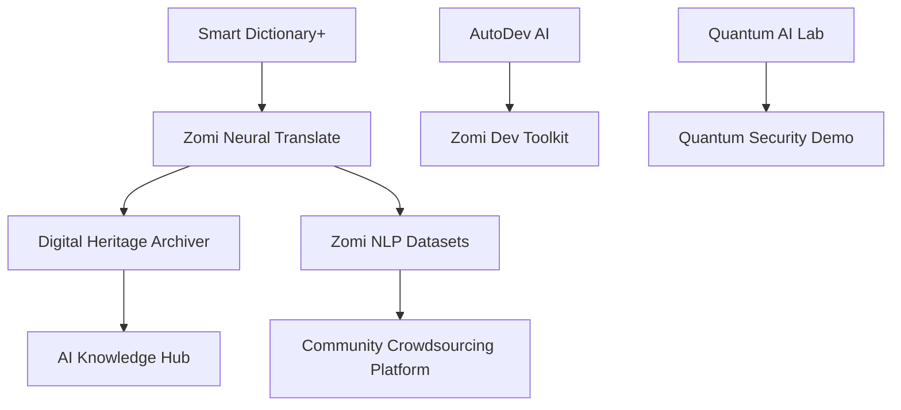

# 🚀 **Zomi Tech Hub**
### **Empowering the Zomi Community Through AI & Innovation**

[](https://github.com/ZomiTechHub/ZomiTechHub#project-status)  
[](https://opensource.org/licenses/MIT)

📢 **Follow us on Socials:** [Twitter](https://twitter.com/ZomiTechHub) • [Discord](https://discord.gg/YOUR_REAL_INVITE) • [LinkedIn](https://linkedin.com/company/zomitechhub)  

---

## 🌟 **What is Zomi Tech Hub?**
**Zomi Tech Hub** is an AI-first initiative focused on empowering the Zomi community through innovation. Our mission:

- ✔️ **Preserve Culture** – AI-powered translation, education, and digital archiving of Zomi heritage.  
- ✔️ **Advance Tech** – Fintech, AI, and Web3 solutions designed for economic inclusion.  
- ✔️ **Ethical Innovation** – Developing culturally sensitive AI models with community-first values.

> *"A model for indigenous technological sovereignty."*

---

## 🛠 **Core Projects**
| Project Name                 | Tech Stack             | Status        | Description |
|------------------------------|------------------------|---------------|-------------------------------------------------------------------|
| **Zomi Neural Translate**    | Python, Hugging Face   | 🚧 In Progress | AI-powered Zomi translation with dialect recognition. |
| **Smart Dictionary+**        | Flask, TTS APIs        | ✅ Alpha Release | Context-aware Zomi definitions with pronunciation support. |
| **Digital Heritage Archiver**| Django, AI tagging     | 🚧 Planning | A digital repository for Zomi traditions, artifacts, and stories. |

📌 **More projects launching soon!**

---

## 📅 **Roadmap**
### 🚀 **2025-2026 (Phase 1: Foundations)**
Phase 1 focuses on building essential infrastructure to demonstrate the impact of AI in cultural preservation and education.

#### ✅ **1. Smart Dictionary+**
- AI-powered, context-aware Zomi definitions.
- Speech synthesis (TTS) for pronunciation guidance.
- Example sentences and dialect tagging.
- Goals:
  - Deploy mobile-first version for students and teachers.
  - Collaborate with linguists for accuracy.
  - Integrate with education systems.

#### 🔄 **2. Zomi Neural Translate**
- Machine Translation model for Zomi ↔ English.
- Uses Hugging Face Transformers with fine-tuned custom datasets.
- Dialect detection module planned for Phase 2.
- Goals:
  - Build open training corpus with community input.
  - Release an MVP API for translation.
  - Enable real-time translation for text and voice.

#### 📌 **3. Digital Heritage Archiver**
- Platform to collect and archive oral traditions, stories, and historical artifacts.
- Semi-automated AI tagging for categorization (e.g., folklore, rituals).
- Multimedia support (text, audio, images).
- Goals:
  - Design platform UI/UX.
  - Collaborate with community elders for data collection.
  - Set up digital rights and consent framework.

---

## 📈 **System Architecture Overview**


---

## 📌 **Real-World Impact**
- 📚 **Zomi Students** – Use Smart Dictionary+ in schools to aid learning and pronunciation.
- 🌍 **Diaspora Connection** – Translate messages across dialects for family and cultural continuity.
- 🛡️ **Cultural Guardians** – Record oral traditions and archive heritage content.
- 💳 **Fintech for All** – Enable trusted financial solutions via AI Fraud Shield and DeFi tools.

---

## 🤝 **How to Contribute?**
We welcome developers, researchers, educators, and advocates from all backgrounds!

### 💡 Quick Start
```bash
# Fork this repository
https://github.com/ZomiTechHub/ZomiTechHub.git

# Clone your fork
cd ZomiTechHub

# Create a new branch
git checkout -b feature-name

# Make changes and commit
git add .
git commit -m "Added feature XYZ"

# Push and open PR
git push origin feature-name
```

🔹 See [CONTRIBUTING.md](CONTRIBUTING.md) for detailed guidelines.

---

## 📢 **Stay Connected**
- **Twitter:** [@ZomiTechHub](https://twitter.com/ZomiTechHub)  
- **Discord:** [Join Us](https://discord.gg/YOUR_REAL_INVITE)  
- **Instagram:** [@ZomiTechHub](https://instagram.com/ZomiTechHub)  
- **LinkedIn:** [Zomi Tech Hub](https://linkedin.com/company/zomitechhub)  
- **Email:** [contact@zomitechhub.org](mailto:contact@zomitechhub.org)

---

🚀 **Join us in shaping the future of Zomi technology and indigenous innovation!**

